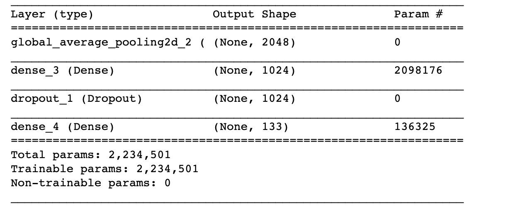
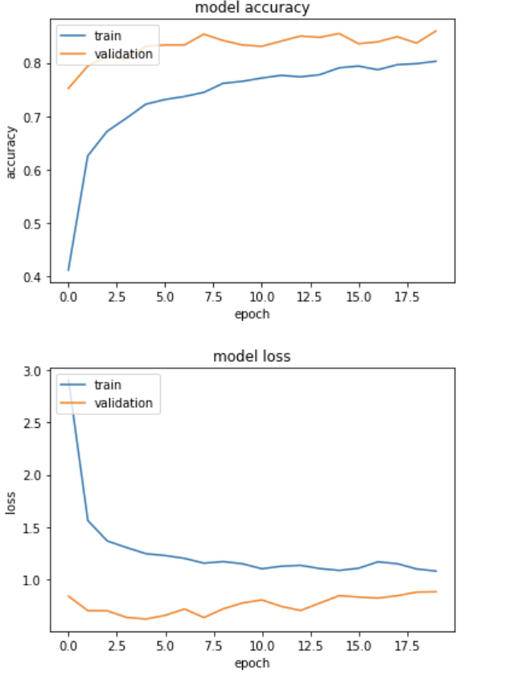

# Table of Contents

0. [Project Overview](#motivation)
1. [Problem Statement](#problem)
2. [Data Exploration & Visualization](#data)
3. [Metrics](#metrics)
4. [Installation](#installation)
5. [File Descriptions](#files)
6. [Results](#results)
7. [Licensing, Authors, and Acknowledgements](#licensing)


# Please look at Jupyter notebook in this repo if you have any unanswered questions. 


## Project Overview <a name="motivation"></a>
When humans look at images, we take for granted that our brain can process the image and decide what the image contains fairly quickly. The goal of my CNN and CNNs in general (at least for image recognition and classification) is to replicate this process algorithmically and to teach our computer how to do this. With this in mind, the aim of this project was to define and train a Convolutional Neural Network (CNN) that could predict dog breeds from images of dogs. 
The final CNN used in the app was built using transfer learning from Google's InceptionV3 CNN, with additional training on dog-specific images provided by udacity.  


## Problem Statement<a name="problem"></a>
Using images provided by udacity, my main objective was to create and train a CNN that could predict dog breeds from images of dogs. 
The image dataset used to train, validate, and test my CNN consisted of 8351 different dog images, with 133 different dog breeds given as labels. This data was provided by Udacity. The images were also passed through Google's InceptionV3 model before being passed into my CNN's layers. 


## Data Exploration & Visualization <a name="data"/>
The train/validation/test data used to refine my CNN consisted of 224 x 224 pixel jpg images of dogs (here's what some of them look like) 


The images were then transformed by keras from 224X224 pixels into 4-D tensors, where the three color channels (RGB)
are represented (each tensor was sized (1,224,224,3). The quantity of our input data and the train/validation/test splits are shown below:
The target dog label count is also given. 


```
total dog categories: 133


total dog images: 8351 
training dog images: 6680 
validation dog images: 835 
test dog images: 836 

```


## Metrics <a name="metrics"></a>

#### CNN Architecture

```
Train on 6680 samples, validate on 835 samples
Epoch 1/20
6560/6680 [============================>.] - ETA: 0s - loss: 2.9215 - acc: 0.4096Epoch 00001: saving model to saved_models/weights.best.inception.hdf5
6680/6680 [==============================] - 3s 506us/step - loss: 2.9058 - acc: 0.4115 - val_loss: 0.8396 - val_acc: 0.7521
Epoch 2/20
6600/6680 [============================>.] - ETA: 0s - loss: 1.5602 - acc: 0.6258Epoch 00002: saving model to saved_models/weights.best.inception.hdf5
6680/6680 [==============================] - 3s 455us/step - loss: 1.5630 - acc: 0.6254 - val_loss: 0.7016 - val_acc: 0.7940
Epoch 3/20
6620/6680 [============================>.] - ETA: 0s - loss: 1.3627 - acc: 0.6725Epoch 00003: saving model to saved_models/weights.best.inception.hdf5
6680/6680 [==============================] - 3s 456us/step - loss: 1.3683 - acc: 0.6716 - val_loss: 0.7009 - val_acc: 0.8132
Epoch 4/20
6640/6680 [============================>.] - ETA: 0s - loss: 1.3000 - acc: 0.6962Epoch 00004: saving model to saved_models/weights.best.inception.hdf5
6680/6680 [==============================] - 3s 455us/step - loss: 1.3050 - acc: 0.6963 - val_loss: 0.6377 - val_acc: 0.8060
Epoch 5/20
6580/6680 [============================>.] - ETA: 0s - loss: 1.2519 - acc: 0.7216Epoch 00005: saving model to saved_models/weights.best.inception.hdf5
6680/6680 [==============================] - 3s 455us/step - loss: 1.2463 - acc: 0.7225 - val_loss: 0.6217 - val_acc: 0.8311
.
.
.
.
.
.
Epoch 19/20
6580/6680 [============================>.] - ETA: 0s - loss: 1.1042 - acc: 0.7983Epoch 00019: saving model to saved_models/weights.best.inception.hdf5
6680/6680 [==============================] - 3s 456us/step - loss: 1.1002 - acc: 0.7985 - val_loss: 0.8792 - val_acc: 0.8371
Epoch 20/20
6580/6680 [============================>.] - ETA: 0s - loss: 1.0823 - acc: 0.8024Epoch 00020: saving model to saved_models/weights.best.inception.hdf5
6680/6680 [==============================] - 3s 455us/step - loss: 1.0801 - acc: 0.8030 - val_loss: 0.8824 - val_acc: 0.8599

```

#### Model Test Accuracy
`Test accuracy: 82.6555%`


#### Training Accuracy/Loss Curves



## Installation and Run <a name="installation"></a>
The app uses the following non-standard packages: To see a list of all of the packages required to run the app, please look at the requirements.txt file in `app_heroku`. 

```
Keras==2.4.3
dash==1.20.0
dash_core_components==1.16.0
opencv_python==4.5.1.48
tensorflow==2.4.1
dash_html_components==1.1.3
Pillow==8.2.0
```
## File Descriptions <a name="files"></a>

`dog_app.ipynb : This file contains all of the work to build the model used in the app`

`dog_app.html : This is a copy of dog_app.ipynb`

`dog_app.pdf : This is a copy of dog_app.ipynb`

`app_heroku : This folder contains all of the files needed to deploy the app to heroku, or to run the app locally`

        - `saved_models` : This folder contains all of the saved CNN model weights
        
        - `app.py` : This is the main app file
        
        - `dog_code.py` : This file reads in images in the app and applies the model to them


#### Run:
##### To view the app in Heroku: https://dogdash.herokuapp.com

##### To run the app locally, follow these steps:

1. `cd app_heroku`
2. `pip install --user virtualenv`
3. `virtualenv env`
4. `source venv/bin/activate`
5. `pip install -r requirements.txt`
6. `python app.py`


When using the app, keep the image size below 1MB for optimum performance!


## Results<a name="results"></a>


## Licensing, Authors, Acknowledgements<a name="licensing"></a>
These CNNs were used for transfer learning: [InceptionV3](https://arxiv.org/abs/1512.00567), [VGG16](https://arxiv.org/abs/1409.1556), and [VGG19](https://arxiv.org/abs/1409.1556) were used. Acknowledgement goes to Udacity for the jupyter notebook template, their bottleneck data extraction code, and all of their lessons and help!
