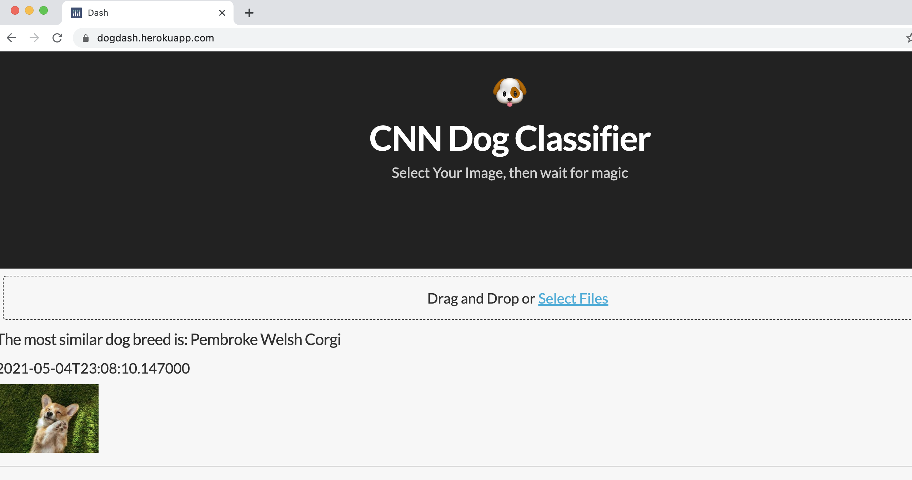

# Table of Contents
0. [IMPORTANT](#important)
1. [Installation](#installation)
2. [Project Motivation](#motivation)
3. [File Descriptions](#files)
4. [Results](#results)
5. [Licensing, Authors, and Acknowledgements](#licensing)

## IMPORTANT <a name="important"></a>
All of the details regarding the work for this project are present in this repository's Jupyter notebook. 


## Project Motivation <a name="motivation"></a>

This application uses a CNN to predict dog breeds from images. 
A comprehensive overview and description of the project motivations, as well as the algorithms and work that went into creating the CNN, are all present in this repository's jupyter notebook/pdf files. In them, I go into a detailed analysis and walkthrough of the build process for the CNN from quantitative and qualitative perspectives. 

When using the app, keep the image size below 1MB for optimum performance!


## Installation and Run <a name="installation"></a>
The app uses the following non-standard packages: To see a list of all of the packages required to run the app, please look at the requirements.txt file in `app_heroku`. 

```
Keras==2.4.3
dash==1.20.0
dash_core_components==1.16.0
opencv_python==4.5.1.48
tensorflow==2.4.1
dash_html_components==1.1.3
Pillow==8.2.0
```

#### Run:
##### To view the app in Heroku: https://dogdash.herokuapp.com

##### To run the app locally, follow these steps:

1. `cd app_heroku`
2. `pip install --user virtualenv`
3. `virtualenv env`
4. `source venv/bin/activate`
5. `pip install -r requirements.txt`
6. `python app.py`


## Results<a name="results"></a>


## Licensing, Authors, Acknowledgements<a name="licensing"></a>
Transfer learning models such as InceptionV3, VGG16, and VGG19 were used. Acknowledgement goes to Udacity for the jupyter notebook template
